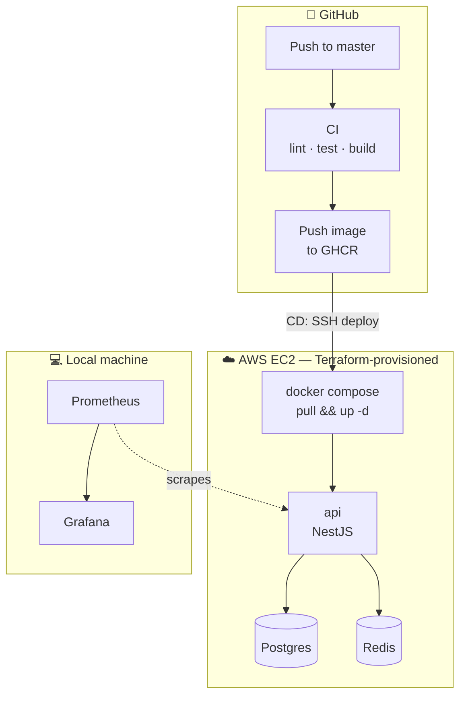

# Knossos

> A DevOps portfolio project. The application itself — a small NestJS warehouse API — is deliberately simple. The point is everything around it: containerization, CI/CD, infrastructure as code, and cloud deployment.

[](https://github.com/les-holikov/knossos/actions/workflows/ci.yml)


## Why this project exists

Named after the ancient Cretan city and its legendary labyrinth — a fitting name for a project about building and navigating infrastructure. The warehouse domain (products made of components) is just a vehicle; the real subject is the platform underneath it.

## Architecture



## Stack

**Application**


**Data**


**Containers**


**CI/CD**


**Infrastructure**


**Monitoring** *(run locally against the deployed host)*


## What's implemented

- ✅ NestJS API with a Product / Component / ProductComponent domain (join entity with its own `quantity`, not a bare many-to-many)
- ✅ Redis caching on read endpoints with cache invalidation on writes
- ✅ Multi-stage Dockerfile + Docker Compose with healthchecks for Postgres and Redis
- ✅ CI pipeline: lint, unit tests, build, image push to GitHub Container Registry
- ✅ CD pipeline: automatic deploy to AWS EC2 on push to `master`
- ✅ Infrastructure provisioned with Terraform (EC2, Security Group, Key Pair)
- ✅ Local Prometheus/Grafana monitoring of the deployed stack

## In progress

- 🔄 PostgreSQL primary + replica (native streaming replication)
- 🔄 PgBouncer / HAProxy as a connection routing layer
- 🔄 `postgres_exporter` wired into the existing Grafana dashboards

## Running locally

```bash
git clone https://github.com/les-holikov/knossos.git
cd knossos
cp .env.example .env   # fill in your own values
docker compose up -d --build
```

The API will be available at `http://localhost:3000`.

## Infrastructure

The AWS infrastructure is fully described in [`infra/`](./infra) using Terraform:

```bash
cd infra
terraform init
terraform plan
terraform apply
```

## License

MIT

